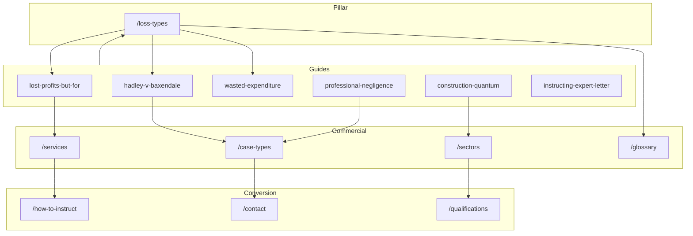
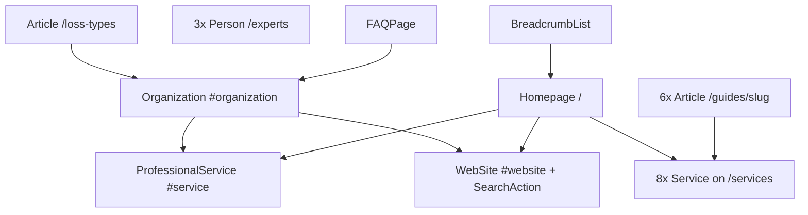

# SEO Architecture — contractlossexpert.com

**Site:** https://www.contractlossexpert.com  
**Audience:** UK solicitors, barristers, and law firms instructing contract loss expert witnesses  
**Primary KPI:** Rank for Tier 1 transactional terms (e.g. *contract loss expert witness UK*, *breach of contract expert witness UK*)  
**Last updated:** May 2026

This document is the canonical SEO blueprint for ContractLossExpert.com. It governs keyword targeting, content clusters, internal linking, structured data, GEO (generative engine optimization), off-page activity, competitor monitoring, and deployment.

---

## Table of contents

1. [Keyword strategy](#1-keyword-strategy)
2. [Content cluster map](#2-content-cluster-map)
3. [Internal linking rules](#3-internal-linking-rules)
4. [Schema architecture](#4-schema-architecture)
5. [GEO optimization targets](#5-geo-optimization-targets)
6. [Off-page SEO targets](#6-off-page-seo-targets)
7. [Competitor monitoring](#7-competitor-monitoring)
8. [Deployment checklist](#8-deployment-checklist)
- [Appendix A: Full route inventory](#appendix-a-full-route-inventory)
- [Appendix B: Sitemap priorities](#appendix-b-sitemap-priorities)
- [Appendix C: Title and meta templates](#appendix-c-title-and-meta-templates)
- [Appendix D: Implementation status](#appendix-d-implementation-status)

---

## 1. Keyword strategy

### Tier 1 — Transactional

| Keyword |
|---------|
| contract loss expert witness |
| contract loss expert witness UK |
| breach of contract expert witness UK |
| lost profits expert witness UK |
| contract damages expert witness |
| quantum expert witness UK |
| contract breach loss quantification expert |
| wasted expenditure expert witness UK |
| consequential loss expert witness |
| construction quantum expert witness UK |

### Tier 2 — Informational

| Keyword |
|---------|
| how to calculate lost profits breach of contract UK |
| what is the but-for methodology |
| Hadley v Baxendale explained for solicitors |
| expectation loss vs reliance loss UK |
| wasted expenditure breach of contract UK |
| what is consequential loss UK |
| how to instruct quantum expert witness |
| contract loss expert witness fees UK |
| duty to mitigate breach of contract |
| SAAMCo principle professional negligence |

### Tier 3 — Long-tail / sector

| Keyword |
|---------|
| construction quantum expert witness UK |
| technology contract loss expert witness |
| supply chain loss expert witness UK |
| professional negligence loss expert UK |
| earn-out dispute expert witness UK |
| franchise breach loss expert witness |
| energy contract loss expert witness |
| IP licence breach expert witness UK |
| commercial contract loss expert London |
| JCT NEC contract quantum expert witness |

### Keyword → URL mapping

| Keyword cluster | Primary URL | Secondary URLs |
|-----------------|-------------|----------------|
| contract loss expert witness (UK) | `/` | `/what-is-a-contract-loss-expert-witness`, `/services` |
| lost profits / but-for | `/loss-types` (expectation section) | `/guides/lost-profits-but-for-methodology`, `/services#lost-profits` |
| Hadley / remoteness / consequential | `/loss-types` | `/guides/hadley-v-baxendale-remoteness-guide`, `/glossary#hadley-v-baxendale` |
| wasted expenditure / reliance | `/loss-types` | `/guides/wasted-expenditure-reliance-loss`, `/services#wasted-expenditure` |
| construction quantum | `/services#construction-quantum` | `/case-types/construction-quantum-disputes`, `/sectors/construction-engineering` |
| professional negligence / SAAMCo | `/case-types/professional-negligence-loss` | `/guides/professional-negligence-loss-quantification` |
| instruct / fees | `/how-to-instruct`, `/fees` | `/guides/instructing-quantum-expert-letter` |
| sector long-tail | `/sectors/[slug]` | matching `/case-types/[slug]` where applicable |
| earn-out / M&A | `/case-types/earn-out-ma-dispute` | `/sectors/financial-services-banking` |
| franchise breach | `/case-types/franchise-agreement-breach` | `/sectors/retail-consumer-goods` |
| IP licence breach | `/case-types/ip-licence-breach` | `/sectors/media-entertainment-ip`, `/services#ip-licensing-loss` |
| supply chain failure | `/case-types/supply-chain-failure` | `/sectors/supply-chain-manufacturing` |
| employment / distribution | `/case-types/employment-contract-loss`, `/case-types/distribution-agency-agreement` | `/services`, `/loss-types` |

---

## 2. Content cluster map

Eight topical hubs anchor the site. The pillar page `/loss-types` sits at the centre of loss-type and methodology clusters.

### Hub overview

| Hub | Pillar / anchor | Primary intent |
|-----|-----------------|----------------|
| 1 | Lost Profits & But-For Methodology | Expectation damages, but-for quantification |
| 2 | Hadley v Baxendale & Remoteness | Consequential loss, two-limb test |
| 3 | Wasted Expenditure & Reliance Loss | Reliance damages, bad bargain |
| 4 | Construction Quantum | JCT/NEC, prolongation, disruption |
| 5 | Professional Negligence Loss | SAAMCo, loss of chance |
| 6 | Sector Specialists | Industry-specific expert matching |
| 7 | Instruction Process | SJE vs PAE, fees, contact |
| 8 | Expert Duties & CPR Part 35 | Ikarian Reefer, qualifications |

### Hub 1: Lost Profits & But-For Methodology

**Supporting pages:**

- `/loss-types` (pillar)
- `/guides/lost-profits-but-for-methodology`
- `/services#lost-profits`
- `/case-types/commercial-contract-breach`
- `/glossary#but-for-analysis`
- `/glossary#expectation-damages`
- `/glossary#robinson-v-harman`
- `/faq` (but-for Q&As)

### Hub 2: Hadley v Baxendale & Remoteness

**Supporting pages:**

- `/guides/hadley-v-baxendale-remoteness-guide`
- `/loss-types` (Hadley section)
- `/case-types/commercial-contract-breach`
- `/glossary#hadley-v-baxendale`
- `/glossary#remoteness`
- `/glossary#consequential-loss`
- `/faq` (remoteness Q&As)

### Hub 3: Wasted Expenditure & Reliance Loss

**Supporting pages:**

- `/guides/wasted-expenditure-reliance-loss`
- `/loss-types` (reliance section)
- `/services#wasted-expenditure`
- `/glossary#reliance-loss`
- `/glossary#duty-to-mitigate`
- `/faq` (wasted expenditure Q&As)

### Hub 4: Construction Quantum

**Supporting pages:**

- `/guides/construction-quantum-expert-guide`
- `/case-types/construction-quantum-disputes`
- `/sectors/construction-engineering`
- `/services#construction-quantum`
- `/glossary#scott-schedule`
- `/glossary#prolongation`
- `/glossary#disruption`
- `/glossary#jct-contract`
- `/glossary#nec-contract`

### Hub 5: Professional Negligence Loss

**Supporting pages:**

- `/guides/professional-negligence-loss-quantification`
- `/case-types/professional-negligence-loss`
- `/services#professional-negligence-damages`
- `/glossary#saamco-principle`
- `/glossary#loss-of-chance`
- `/glossary#allied-maples-principle`

### Hub 6: Sector Specialists

**Supporting pages:**

- `/sectors/[all 8 slugs]` (see inventory below)
- `/case-types` cross-referenced by sector
- `/guides` with sector references where relevant

### Hub 7: Instruction Process

**Supporting pages:**

- `/how-to-instruct`
- `/guides/instructing-quantum-expert-letter`
- `/fees`
- `/qualifications`
- `/contact`

### Hub 8: Expert Duties & CPR Part 35

**Supporting pages:**

- `/qualifications` (CPR section)
- `/what-is-a-contract-loss-expert-witness`
- `/glossary#cpr-part-35`
- `/glossary#ikarian-reefer`
- `/faq` (CPR Q&As)

### Content cluster diagram



### Slug inventories

#### Services (8 anchors on `/services`)

| Anchor ID | Label |
|-----------|-------|
| `lost-profits` | Lost Profits |
| `wasted-expenditure` | Wasted Expenditure |
| `consequential-loss` | Consequential Loss |
| `construction-quantum` | Construction Quantum |
| `supply-chain-loss` | Supply Chain Loss |
| `professional-negligence-damages` | Professional Negligence |
| `ip-licensing-loss` | IP Licence Loss |
| `expert-determination` | Expert Determination |

*Source: `src/components/layout/Footer.tsx`, `src/lib/schema.ts` (`serviceNode` IDs).*

#### Case types (10)

| Slug | H1 focus |
|------|----------|
| `commercial-contract-breach` | Commercial Contract Breach Loss Expert Witness UK |
| `construction-quantum-disputes` | Construction Contract Quantum Expert Witness UK |
| `supply-chain-failure` | Supply Chain Failure Contract Loss Expert Witness UK |
| `professional-negligence-loss` | Professional Negligence Contract Loss Expert Witness UK |
| `ip-licence-breach` | IP Licence Breach Contract Loss Expert Witness UK |
| `earn-out-ma-dispute` | Earn-Out & M&A Dispute Contract Loss Expert Witness UK |
| `franchise-agreement-breach` | Franchise Agreement Breach Contract Loss Expert Witness UK |
| `employment-contract-loss` | Employment Contract Loss Expert Witness UK |
| `joint-venture-dispute` | Joint Venture Dispute Contract Loss Expert Witness UK |
| `distribution-agency-agreement` | Distribution & Agency Agreement Breach Expert Witness UK |

#### Sectors (8)

| Slug | H1 focus |
|------|----------|
| `construction-engineering` | Construction & Engineering Contract Loss Expert Witness UK |
| `technology-software` | Technology & Software Contract Loss Expert Witness UK |
| `supply-chain-manufacturing` | Supply Chain & Manufacturing Contract Loss Expert Witness UK |
| `financial-services-banking` | Financial Services & Banking Contract Loss Expert Witness UK |
| `retail-consumer-goods` | Retail & Consumer Goods Contract Loss Expert Witness UK |
| `professional-services` | Professional Services Contract Loss Expert Witness UK |
| `energy-utilities` | Energy & Utilities Contract Loss Expert Witness UK |
| `media-entertainment-ip` | Media, Entertainment & IP Contract Loss Expert Witness UK |

*Aligned with `src/components/forms/ContactForm.tsx` sector dropdown.*

#### Guides (6)

| Slug | `aboutServiceId` (Article schema) |
|------|-----------------------------------|
| `hadley-v-baxendale-remoteness-guide` | `consequential-loss` |
| `lost-profits-but-for-methodology` | `lost-profits` |
| `wasted-expenditure-reliance-loss` | `wasted-expenditure` |
| `construction-quantum-expert-guide` | `construction-quantum` |
| `professional-negligence-loss-quantification` | `professional-negligence-damages` |
| `instructing-quantum-expert-letter` | *(none — procedural guide)* |

#### Glossary (30 terms, definition-first)

| # | Term | Anchor slug |
|---|------|-------------|
| 1 | Adjudication (Construction) | `#adjudication-construction` |
| 2 | Allied Maples Principle (Loss of Chance) | `#allied-maples-principle` |
| 3 | But-For Analysis | `#but-for-analysis` |
| 4 | Cavendish Square Rule (Penalty Clauses) | `#cavendish-square-rule` |
| 5 | Causation | `#causation` |
| 6 | Commercial Agents Regulations 1993 | `#commercial-agents-regulations-1993` |
| 7 | Consequential Loss | `#consequential-loss` |
| 8 | CPR Part 35 | `#cpr-part-35` |
| 9 | Diminution in Value | `#diminution-in-value` |
| 10 | Disruption (Construction) | `#disruption` |
| 11 | Duty to Mitigate | `#duty-to-mitigate` |
| 12 | Earn-Out Agreement | `#earn-out-agreement` |
| 13 | Expectation Damages | `#expectation-damages` |
| 14 | FIDIC Contract | `#fidic-contract` |
| 15 | Force Majeure | `#force-majeure` |
| 16 | Hadley v Baxendale [1854] | `#hadley-v-baxendale` |
| 17 | The Ikarian Reefer Duties | `#ikarian-reefer` |
| 18 | JCT Contract | `#jct-contract` |
| 19 | Joint Statement (Expert Witnesses) | `#joint-statement` |
| 20 | Loss and Expense (Construction) | `#loss-and-expense` |
| 21 | Loss of Chance | `#loss-of-chance` |
| 22 | NEC Contract | `#nec-contract` |
| 23 | Party-Appointed Expert (PAE) | `#party-appointed-expert` |
| 24 | Prolongation (Construction) | `#prolongation` |
| 25 | Quantum | `#quantum` |
| 26 | Reliance Loss | `#reliance-loss` |
| 27 | Remoteness | `#remoteness` |
| 28 | Robinson v Harman [1848] | `#robinson-v-harman` |
| 29 | SAAMCo Principle | `#saamco-principle` |
| 30 | Scott Schedule | `#scott-schedule` |

**Default glossary internal links:**

| Term | Link target |
|------|-------------|
| Hadley v Baxendale | `/guides/hadley-v-baxendale-remoteness-guide` |
| But-For Analysis | `/guides/lost-profits-but-for-methodology` |
| Expectation Damages | `/loss-types` |
| Reliance Loss | `/loss-types` |
| Wasted Expenditure (via Reliance) | `/guides/wasted-expenditure-reliance-loss` |
| CPR Part 35 | `/qualifications` |
| Scott Schedule | `/case-types/construction-quantum-disputes` |
| JCT / NEC / FIDIC | `/sectors/construction-engineering` |
| SAAMCo | `/case-types/professional-negligence-loss` |
| Loss of Chance / Allied Maples | `/guides/professional-negligence-loss-quantification` |

---

## 3. Internal linking rules

### Rule 1 — `/loss-types` links to:

- All relevant `/glossary` terms (inline + related terms block)
- `/case-types/commercial-contract-breach`
- `/guides/lost-profits-but-for-methodology`
- `/guides/wasted-expenditure-reliance-loss`
- `/guides/hadley-v-baxendale-remoteness-guide`
- `/services` (and section anchors where cited)
- `/contact`

### Rule 2 — Every `/case-types/[slug]` links to:

- Relevant `/services` section (hash anchor)
- Relevant `/sectors/[slug]` where applicable
- Relevant `/guides/[slug]` where applicable
- `/loss-types` (key section anchor, e.g. `#expectation-loss`)
- `/glossary` (key terms used on page)
- `/how-to-instruct`
- `/contact`

### Rule 3 — Every `/sectors/[slug]` links to:

- Relevant `/case-types/[slug]`
- Relevant `/services` section
- `/loss-types`
- `/qualifications`
- `/contact`

### Rule 4 — Every `/guides/[slug]` links to:

- `/guides` (hub)
- Relevant `/case-types`
- Relevant `/sectors`
- `/loss-types`
- `/how-to-instruct`
- `/qualifications`
- `/contact`

### Rule 5 — `/glossary` terms link to:

- Most relevant `/case-types/[slug]`
- Most relevant `/guides/[slug]`
- `/loss-types` for loss-type terms
- `/sectors/[slug]` for sector-specific terms

### Rule 6 — Homepage links to:

- All 8 `/services` sections (via cards → `#anchor`)
- `/loss-types`
- `/case-types`
- `/sectors`
- `/what-is-a-contract-loss-expert-witness`
- `/guides`
- `/faq`
- `/contact`

### Implementation matrix

| Page template | Required outbound links | Enforce via |
|---------------|-------------------------|-------------|
| `LossTypesPage` | glossary (6+), 3 guides, services, case-type, contact | content + `RelatedLinks` |
| `CaseTypePage` | services#, sector, guide, loss-types#, glossary, instruct, contact | `relatedLinks` in `src/data/case-types.ts` |
| `SectorPage` | case-type, services#, loss-types, qualifications, contact | `relatedLinks` in `src/data/sectors.ts` |
| `GuidePage` | guides hub, case-types, sectors, loss-types, instruct, qualifications, contact | `relatedLinks` in `src/data/guides.ts` |
| `GlossaryPage` | per-term links (table above) | `src/data/glossary.ts` |
| `HomePage` | 8 services, hubs, definition page, guides, faq, contact | static section components |
| `ServicesPage` | loss-types, case-types, contact per section | section footers |

Use the `relatedLinks?: { href: string; label: string }[]` field on `ContentPage` / `GuidePage` in `src/data/types.ts` and a shared `RelatedLinks` component on all templates.

### Navigation reference

Desktop nav (`src/components/layout/Header.tsx`): Home, Services, Loss Types, Case Types, Sectors, Guides, How to Instruct, Qualifications, Fees, FAQ, Contact + CTA → `/contact`.

Footer columns (`src/components/layout/Footer.tsx`): Services (8 hashes), Case Types (5 featured + hub), Resources (Guides, Glossary, FAQ, Fees, How to Instruct, Loss Types), About (Experts, Qualifications, Contact).

---

## 4. Schema architecture

### Root entity

**Organization**  
`@id`: `https://www.contractlossexpert.com/#organization`

Implemented in `src/lib/schema.ts` as `organizationSchema`. Published from homepage `@graph`.

### Schema hierarchy



### Children by page type

| Schema type | Pages | Helper (`src/lib/schema.ts`) | Component |
|-------------|-------|------------------------------|-----------|
| Organization | Homepage `@graph` | `organizationSchema` | `JsonLd` |
| ProfessionalService | Homepage | `professionalServiceSchema` | `JsonLd` |
| WebSite + SearchAction | Homepage | `websiteSchema` (glossary search URL) | `JsonLd` |
| Service (×8) | `/services` | `serviceNode(id, name, desc)` | `JsonLd` |
| Article (pillar) | `/loss-types` | `articleSchema` — `about` → `#lost-profits` | `JsonLd` |
| Article (×6) | `/guides/[slug]` | `articleSchema` + `aboutServiceId` | `JsonLd` |
| Person (×3) | `/experts` | `personSchema` | `JsonLd` |
| FAQPage | `/faq` (12 Q&As) | `faqPageSchema` | `JsonLd` |
| FAQPage | `/glossary` (30 terms) | `faqPageSchema` | `JsonLd` |
| FAQPage | `/case-types/[slug]` (×10) | `faqPageSchema` | `JsonLd` |
| FAQPage | `/sectors/[slug]` (×8) | `faqPageSchema` | `JsonLd` |
| BreadcrumbList | All non-homepage | `breadcrumbSchema` | `JsonLd` |

### Service `@id` nodes (must match `/services` anchors)

```
https://www.contractlossexpert.com/services#lost-profits
https://www.contractlossexpert.com/services#wasted-expenditure
https://www.contractlossexpert.com/services#consequential-loss
https://www.contractlossexpert.com/services#construction-quantum
https://www.contractlossexpert.com/services#supply-chain-loss
https://www.contractlossexpert.com/services#professional-negligence-damages
https://www.contractlossexpert.com/services#ip-licensing-loss
https://www.contractlossexpert.com/services#expert-determination
```

### Homepage `@graph` example

Render a single `<JsonLd>` with `@context` + `@graph` array containing:

1. `organizationSchema`
2. `professionalServiceSchema`
3. `websiteSchema`
4. All 8 `serviceNode(...)` entries (or reference by `@id` only on homepage)

### Indexing exclusions

| Path | robots |
|------|--------|
| `/thank-you` | `noindex, nofollow` |
| `/privacy` | `noindex, follow` |
| `/terms` | `noindex, follow` |

Use `createMetadata({ noindex: true })` in `src/lib/metadata.ts`.

### Wiring checklist (dev)

- [ ] Import `JsonLd` from `src/components/JsonLd.tsx` on every page template
- [ ] Homepage: full `@graph`
- [ ] Pass `faqs` from content data into `faqPageSchema` on case-type, sector, faq, glossary pages
- [ ] Pass `aboutServiceId` into `articleSchema` for guides per table in Section 2
- [ ] Breadcrumbs: pass trail into `breadcrumbSchema` via shared `PageHero` or layout

---

## 5. GEO optimization targets

AI systems and answer engines should cite structured, definition-first content. Priority assets:

### Citation assets (10)

| # | Asset | Page | Location / format |
|---|-------|------|-------------------|
| 1 | Types of contract loss comparison table | `/loss-types` | H2: The Three Main Types of Recoverable Loss — columns: Type, Legal Basis, Aim, When Used |
| 2 | Hadley v Baxendale two-limb table | `/loss-types` | H2: Consequential Loss — columns: Loss Type, Example, Limb |
| 3 | Consequential loss recoverable vs not table | `/loss-types` | Same section — direct vs Limb 2 vs not recoverable |
| 4 | But-for methodology steps | `/guides/lost-profits-but-for-methodology` | Numbered steps: baseline → counterfactual → actual vs but-for → net loss |
| 5 | Expectation vs reliance comparison | `/loss-types` | Summary table in Three Main Types section |
| 6 | Construction quantum methodology table | `/services` | H2: Construction Quantum Claims — columns: Phase, What We Do, Deliverable |
| 7 | Key statistics table | `/` (homepage) | H2: Key UK Statistics — columns: Metric, Figure, Source |
| 8 | Glossary (30 terms) | `/glossary` | Definition-first; one H2 or term block per entry; client-side search |
| 9 | SJE vs PAE comparison | `/how-to-instruct` | Step 4 — table or two-column comparison |
| 10 | Instruction process timeline | `/how-to-instruct` | 7-step matching timeline (Identify loss → Letter of instruction) |

### Homepage statistics table (asset 7)

| Metric | Figure | Source |
|--------|--------|--------|
| Typical expert hourly rate | £250–£600/hr | Industry average |
| Governing rule — remoteness | Hadley v Baxendale [1854] | Contract law |
| Primary damage measure | Expectation loss (but-for) | Robinson v Harman [1848] |
| Alternative measure | Reliance loss / wasted expenditure | Anglia TV v Reed [1972] |
| Court framework | CPR Part 35 | Civil Procedure Rules |
| Duty to mitigate | Yes — claimant must minimise loss | UK contract law |
| Arbitration frameworks | LCIA, ICC, UNCITRAL | As applicable |

### Lost profits methodology table (asset 6 pattern on `/services`)

| Phase | What We Do | Deliverable |
|-------|------------|-------------|
| 1. Data Gathering | Financial statements, management accounts, forecasts, contracts | Financial dataset |
| 2. Baseline Construction | Establish pre-breach trading position | But-for revenue model |
| 3. Counterfactual | Project performance absent breach | But-for profit model |
| 4. Loss Calculation | Actual vs but-for comparison | Net lost profit figure |
| 5. Report | CPR Part 35 expert report with workings | Court-ready report |

### GEO content format rules

1. **Definition first** — lead each H2 with a one-sentence legal definition before analysis.
2. **Tables before narrative** — place comparison tables immediately under the H2.
3. **UK citations** — include case names and years (e.g. *Hadley v Baxendale* [1854] 9 Ex Ch 341).
4. **Solicitor-facing tone** — practical instruction focus, not consumer FAQ.
5. **Stable URLs** — pillar and guides are primary citation targets; use canonical URLs from `createMetadata`.
6. **Anchor IDs** — glossary and loss-types sections use predictable `#slug` anchors for deep links.

---

## 6. Off-page SEO targets

### Expert witness directories

| Directory | URL | Action |
|-----------|-----|--------|
| UK Register of Expert Witnesses | jspubs.com | Submit firm listing — loss/quantum category |
| Academy of Experts | academyofexperts.org | Membership / directory profile |
| Expert Witness Institute (EWI) | ewi.org.uk | Membership listing |
| TCC expert listings | (via professional bodies / court lists) | Monitor for construction quantum experts |
| The Law Society expert finder | lawsociety.org.uk | Where applicable for forensic accountants |
| Lexvisio.com | lexvisio.com | Profile with contract loss / quantum focus |

### Publications for citations and contributed content

| Publication | Angle |
|-------------|-------|
| Construction Law Journal | Construction quantum, Scott Schedules, TCC practice |
| Practical Law (Thomson Reuters) | Lost profits methodology, instruction checklists |
| Commercial Dispute Resolution (CDR) | Remoteness, consequential loss trends |
| Lexology | Solicitor guides (Hadley, but-for, SAAMCo) |
| Accountancy Age | Forensic accountant expert witness role |
| Building Magazine | Construction dispute quantum data |

### Digital PR angles

| Campaign | Hook |
|----------|------|
| Hadley v Baxendale at 170 | How courts apply remoteness in 2025 commercial disputes |
| Construction quantum disputes on the rise | UK 2025 data / TCC caseload commentary |
| Wasted expenditure claims | When reliance loss beats expectation damages |
| SAAMCo after recent case law | Professional negligence damages in 2025 |
| The but-for test | How UK courts assess lost profits claims |

### Off-page tracking (monthly)

| Field | What to record |
|-------|----------------|
| Directory | Listing live? URL, category, last updated |
| Publication | Pitch sent / published / backlink URL |
| Digital PR | Angle, target outlet, status, live URL |
| Backlinks | New referring domains (Ahrefs / GSC) |

---

## 7. Competitor monitoring

### URLs to review monthly

| Competitor | URL |
|------------|-----|
| Inquesta Forensic | https://www.inquestaforensic.co.uk/blog/recovery-of-damages-for-lost-profits/ |
| Expert Commercial Law | https://www.expertcommerciallaw.co.uk/business-expert-witness/ |
| Quantuma | https://www.quantuma.com/services/disputes/expert-witness/ |
| JSPubs (loss of earnings) | https://www.jspubs.com/expert-witness/si/l/loss-of-earnings/ |
| FTI Consulting | https://www.fticonsulting.com/uk/quantum-damages-experts |

### Monthly checklist

- [ ] New blog posts or guide pages published
- [ ] New backlinks (check top pages in GSC / Ahrefs)
- [ ] New case-type or sector landing pages
- [ ] Key case law or statute updates referenced
- [ ] Title/meta changes on money pages (lost profits, quantum, expert witness)
- [ ] New FAQ or glossary-style content (GEO competitors)

### Competitor diff log template

```markdown
## YYYY-MM — Competitor review

| Competitor | New URLs | Notable content | Backlink / PR | Case law updates |
|------------|----------|-----------------|---------------|------------------|
| Inquesta | | | | |
| Expert Commercial Law | | | | |
| Quantuma | | | | |
| JSPubs | | | | |
| FTI Consulting | | | | |

**Actions for ContractLossExpert:** (e.g. new guide, internal link, outreach)
```

**Owner:** Marketing / SEO lead  
**Cadence:** First week of each month

---

## Sitemap & robots generation

Both files are **generated by a Node script** (not hand-edited) so the URL list stays aligned with the app.

| Output | Path | Generator |
|--------|------|-----------|
| XML sitemap | `public/sitemap.xml` | `scripts/generate-seo.ts` |
| robots.txt | `public/robots.txt` | `scripts/generate-seo.ts` |

### URL inventory (`buildPublicUrlInventory`)

Source: `src/lib/seo/publicUrlInventory.ts`

- **Static routes** — `APP_STATIC_PATHS` (13 indexable marketing pages)
- **Dynamic routes** — slugs from `src/data/case-types.ts`, `sectors.ts`, `guides.ts`
- **Excluded from sitemap** — `/contact`, `/thank-you`, `/privacy`, `/terms`
- Canonical host — `https://www.contractlossexpert.com` (or `NEXT_PUBLIC_SITE_URL`)

### Commands

```bash
npm run seo:generate   # Regenerate sitemap.xml + robots.txt
npm run seo:verify     # Fail if sitemap <loc> entries drift from inventory
```

`npm run build` runs `seo:generate` automatically before `next build`.

**After adding a new static route:** add its path to `APP_STATIC_PATHS`, then run `seo:generate`.

Next.js `src/app/sitemap.ts` and `src/app/robots.ts` are **not used** — static files in `public/` are served at `/sitemap.xml` and `/robots.txt`.

---

## 8. Deployment checklist

### Infrastructure

- [ ] **Vercel deployment** — production branch connected; preview URLs noindex
- [ ] **DNS** — `contractlossexpert.com` → 301 to `www.contractlossexpert.com` (implemented in `middleware.ts`)
- [ ] **SSL** — HTTPS on www subdomain

### Environment variables (`.env.example`)

| Variable | Purpose |
|----------|---------|
| `NEXT_PUBLIC_FORMSPREE_FORM_ID` | Contact form submissions |
| `NEXT_PUBLIC_SITE_URL` | Canonical base URL (`https://www.contractlossexpert.com`) |
| `NEXT_PUBLIC_GA_MEASUREMENT_ID` | Google Analytics 4 |
| `GOOGLE_SITE_VERIFICATION` | Search Console |
| `BING_SITE_VERIFICATION` | Bing Webmaster Tools |

**Note:** `SITE_URL` is currently hardcoded in `src/lib/site.ts`. Prefer reading `process.env.NEXT_PUBLIC_SITE_URL` with fallback for production parity.

### Internationalization and locale

- [x] `html lang="en-GB"` in `src/app/layout.tsx`
- [x] `hreflang`: `en-GB` and `x-default` via `buildHreflangAlternates` in `createMetadata` (every page)
- [ ] `hreflang` `en-US` — defer until US-localized content exists
- [x] `openGraph.locale`: `en_GB` in `createMetadata`

### Analytics and verification

- [x] GA4 script in root layout using `NEXT_PUBLIC_GA_MEASUREMENT_ID`
- [x] `metadata.verification.google` ← `GOOGLE_SITE_VERIFICATION`
- [x] Bing via `metadata.other['msvalidate.01']` ← `BING_SITE_VERIFICATION`

### Technical SEO files

- [x] `public/sitemap.xml` — generated via `npm run seo:generate` (Appendix B priorities)
- [x] `public/robots.txt` — generated; disallows `/thank-you`, `/api/`
- [x] `npm run seo:verify` — inventory drift check
- [x] Wire `JsonLd` on all page templates (Section 4)
- [x] `createMetadata` per route
- [x] Internal linking via `seo-internal-links.ts` + `RelatedLinks`
- [x] Glossary deep-link anchors per Section 2 slug table

### Social and directories

- [ ] **LinkedIn:** ContractLossExpert company page — URL in `LINKEDIN_URL` (`src/lib/site.ts`)
- [ ] Submit to **jspubs**, **Academy of Experts**, **EWI** (Section 6)

### Post-launch

- [ ] Google Search Console — submit sitemap
- [ ] Bing Webmaster Tools — submit sitemap
- [ ] Validate structured data (Rich Results Test) on homepage, `/loss-types`, one case-type, one guide
- [ ] Confirm apex redirect and canonical tags on sample URLs

### Technical SEO implementation map

| Task | File |
|------|------|
| Apex → www 301 | `middleware.ts` ✅ |
| Metadata helper | `src/lib/metadata.ts` ✅ |
| Schema builders | `src/lib/schema.ts` ✅ |
| JSON-LD renderer | `src/components/JsonLd.tsx` ✅ |
| Header / footer IA | `src/components/layout/Header.tsx`, `Footer.tsx` ✅ |
| Internal link merge | `src/lib/seo-internal-links.ts` ✅ |
| RelatedLinks / ServiceSectionFooter | `src/components/RelatedLinks.tsx`, `ServiceSectionFooter.tsx` ✅ |
| Contact form env | `src/components/forms/ContactForm.tsx` |
| `lang` + hreflang | `src/app/layout.tsx` |
| Sitemap | `public/sitemap.xml` via `scripts/generate-seo.ts` ✅ |
| Robots | `public/robots.txt` via `scripts/generate-seo.ts` ✅ |
| URL inventory | `src/lib/seo/publicUrlInventory.ts` ✅ |

---

## Appendix A: Full route inventory

| # | Route | Type | Sitemap | Notes |
|---|-------|------|---------|-------|
| 1 | `/` | Static | Yes (1.0) | Homepage + `@graph` schema |
| 2 | `/what-is-a-contract-loss-expert-witness` | Static | Yes (0.90) | Definition / CPR intro |
| 3 | `/services` | Static | Yes (0.95) | 8 service sections |
| 4 | `/loss-types` | Static | Yes (0.95) | **Pillar / GEO hub** |
| 5 | `/case-types` | Hub | Yes (0.92) | Lists 10 case types |
| 6 | `/case-types/[slug]` | Dynamic (×10) | Yes (0.88) | FAQPage JSON-LD |
| 7 | `/sectors` | Hub | Yes (0.90) | Lists 8 sectors |
| 8 | `/sectors/[slug]` | Dynamic (×8) | Yes (0.86) | FAQPage JSON-LD |
| 9 | `/qualifications` | Static | Yes (0.88) | CPR Part 35 |
| 10 | `/how-to-instruct` | Static | Yes (0.88) | SJE vs PAE, timeline |
| 11 | `/fees` | Static | Yes (0.88) | Rate guidance |
| 12 | `/faq` | Static | Yes (0.87) | 12 Q&As, FAQPage |
| 13 | `/guides` | Hub | Yes (0.87) | Lists 6 guides |
| 14 | `/guides/[slug]` | Dynamic (×6) | Yes (0.80) | Article JSON-LD |
| 15 | `/experts` | Static | Yes (0.80) | 3× Person schema |
| 16 | `/glossary` | Static | Yes (0.75) | 30 terms, FAQPage |
| 17 | `/contact` | Static | **Exclude** | Conversion page |
| 18 | `/thank-you` | Static | **Exclude** | noindex, nofollow |
| 19 | `not-found` | Error | N/A | Custom 404 |
| 20 | `/privacy` | Static | **Exclude** | noindex, follow |
| 21 | `/terms` | Static | **Exclude** | noindex, follow |

**Total indexable URLs (approx.):** 1 + 12 hubs/static + 10 case-types + 8 sectors + 6 guides = **37**

---

## Appendix B: Sitemap priorities

| Path | Priority | changefreq |
|------|----------|------------|
| `/` | 1.0 | weekly |
| `/services` | 0.95 | monthly |
| `/loss-types` | 0.95 | monthly |
| `/case-types` | 0.92 | monthly |
| `/sectors` | 0.90 | monthly |
| `/what-is-a-contract-loss-expert-witness` | 0.90 | monthly |
| `/qualifications` | 0.88 | monthly |
| `/how-to-instruct` | 0.88 | monthly |
| `/fees` | 0.88 | monthly |
| `/case-types/[slug]` | 0.88 | monthly |
| `/faq` | 0.87 | monthly |
| `/guides` | 0.87 | monthly |
| `/sectors/[slug]` | 0.86 | monthly |
| `/experts` | 0.80 | monthly |
| `/guides/[slug]` | 0.80 | monthly |
| `/glossary` | 0.75 | monthly |

**Exclude from sitemap:** `/contact`, `/thank-you`, `/privacy`, `/terms`

Implemented via `scripts/generate-seo.ts` → `public/sitemap.xml` (not `src/app/sitemap.ts`). See **Sitemap & robots generation** below.

---

## Appendix C: Title and meta templates

Use `createMetadata({ title, description, path })` from `src/lib/metadata.ts` on every page.

| Route | Title | Meta description (summary) |
|-------|-------|----------------------------|
| `/` | Contract Loss Expert Witness UK \| Lost Profits & Breach of Contract Damages | UK contract loss experts; lost profits, wasted expenditure; CPR Part 35 |
| `/what-is-a-contract-loss-expert-witness` | What Is a Contract Loss Expert Witness? \| UK Role & Definition | Role, expectation/reliance, but-for, CPR Part 35 |
| `/services` | Contract Loss Expert Witness Services UK \| Full Service List | 8 services: lost profits, construction quantum, etc. |
| `/loss-types` | Types of Contract Loss UK \| Expectation, Reliance & Wasted Expenditure Explained | Pillar: types of recoverable loss for solicitors |
| `/case-types` | Case Types Requiring a Contract Loss Expert Witness \| UK Guide | Hub for 10 dispute types |
| `/sectors` | Contract Loss Expert Witnesses by Sector \| UK Industry Specialists | Hub for 8 sectors |
| `/qualifications` | Contract Loss Expert Witness Qualifications UK \| ACA, CFA & Quantum Credentials | Credentials, CPR Part 35 |
| `/how-to-instruct` | How to Instruct a Contract Loss Expert Witness UK \| Step-by-Step Guide | SJE, PAE, letter of instruction |
| `/fees` | Contract Loss Expert Witness Fees UK \| 2025 Hourly Rates & Costs | £250–£600/hr indicative |
| `/faq` | Contract Loss Expert Witness FAQ UK \| Common Questions Answered | But-for, Hadley, fees, CPR |
| `/guides` | Solicitor Guides: Contract Loss Expert Witnesses UK \| Quantum & Damages | Hub for 6 guides |
| `/experts` | Our Contract Loss Expert Witnesses \| UK Forensic Accountants & Quantum Experts | Expert profiles |
| `/glossary` | Contract Loss Expert Witness Glossary \| Key UK Legal & Finance Terms | 30 definitions |
| `/contact` | Instruct a Contract Loss Expert Witness \| ContractLossExpert.com UK | Lead form; match within 1 business day |

**Dynamic pages:** append context to title — e.g. `{H1} | ContractLossExpert UK` — keep under ~60 characters where possible.

---

## Appendix D: Implementation status

Snapshot as of May 2026 (post SEO upgrade pass).

| Component | Status | Location |
|-----------|--------|----------|
| Apex → www redirect | Done | `middleware.ts` |
| Site constants + env `SITE_URL` | Done | `src/lib/site.ts` |
| Metadata helper (`createMetadata`) | Done | `src/lib/metadata.ts` |
| hreflang `en-GB` + `x-default` | Done | `src/lib/metadata.ts` (`buildHreflangAlternates`) |
| Search Console / Bing verification | Done | `createMetadata` + env vars |
| Schema helpers + homepage `@graph` | Done | `src/lib/schema.ts`, `src/app/page.tsx` |
| JsonLd on all page templates | Done | Per-route `JsonLd` usage |
| Header / Footer nav IA | Done | `src/app/layout.tsx` |
| All 37 indexable routes | Done | `src/app/**` |
| Content data (case-types, sectors, guides, glossary) | Done | `src/data/*.ts` |
| sitemap.ts / robots.ts | Done | `src/app/sitemap.ts`, `robots.ts` |
| GA4 script | Done | `src/app/layout.tsx` |
| Glossary anchor IDs (`#slug`) | Done | `src/lib/glossary-slug.ts`, `GlossarySearch.tsx` |
| Internal link rules (automated merge) | Done | `src/lib/seo-internal-links.ts` |
| `RelatedLinks` component | Done | `src/components/RelatedLinks.tsx` |
| Service section footers | Done | `src/components/ServiceSectionFooter.tsx` |
| Pillar `/loss-types` section anchors | Done | `#expectation-loss`, `#reliance-loss`, `#consequential-loss` |
| SJE vs PAE comparison table | Done | `/how-to-instruct` |
| Homepage hub links (Rule 6) | Done | `src/app/page.tsx` |
| `en-US` hreflang | Deferred | Add only if US-localized pages are published |
| Off-page directory submissions | Manual | Section 6 — marketing task |
| Competitor monitoring log | Manual | Section 7 — monthly cadence |

**Next recommended actions (non-code):**

1. Submit sitemap in Google Search Console and Bing Webmaster Tools
2. Validate structured data (Rich Results Test) on `/`, `/loss-types`, one case-type, one guide
3. Execute off-page directory listings (jspubs, EWI, Academy of Experts)
4. Begin monthly competitor diff log (Section 7)

---

*This document should be updated when new routes, glossary terms, or schema types are added. Do not edit the Cursor plan file; update this file as the source of truth.*
